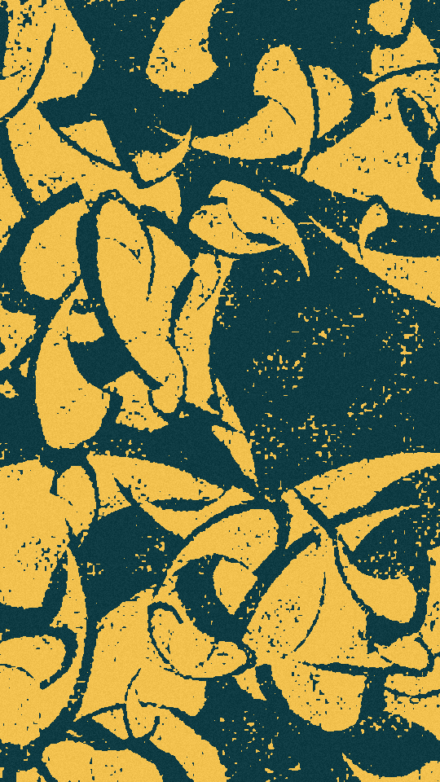

Curved blades scattered across a sheet in one ink. Each blade bends along its length and tapers to a point or a blunt end. The edges break up into flecks, and a few flecks land out in the open ground, the way ink takes unevenly on rough paper. Large blades lie underneath and small ones on top.

chaff renders a Still: one frame. Its site page is [playgrnd.tools/chaff](https://www.playgrnd.tools/chaff/).

## Still



Seed 1, rendered by:

```sh
tirage derive --seed 1 --tool chaff | tirage render --size 540x960 -o chaff.png
```

## Parameters

As [`tirage tools`](/cli-reference/tools/) lists them, each with its range and step, or its choices:

```
chaff  1 frame
  count       4..=400   step 1
  size        0..=1     step 0.01
  vary        0..=1     step 0.01
  apart       0..=1     step 0.01
  shapes      Crescent, Leaf, Bar
  curve       0..=1     step 0.01
  slim        0..=1     step 0.01
  taper       0..=1     step 0.01
  mottle      0..=1     step 0.01
  coarse      0..=1     step 0.01
  grain       0..=1     step 0.01
  ditherTog   on/off
  dthKinds    Bayer 8, Bayer 4, Noise
  dthSize     1..=10    step 1
  dthLevels   2..=8     step 1
  dthAmount   0..=1     step 0.05
  grainTog    on/off
  grnBlends   Add, Overlay, Soft light, Multiply, Screen
  grnAmount   0..=1     step 0.05
  grnSize     0.5..=4   step 0.1
  grnSpecks   0..=1     step 0.05
  grnVignette 0..=1     step 0.05
```

A Seed draws every Parameter of chaff's own except `grain`. `count` is the number of blades and `size` their base length. `vary` spreads the lengths, so a few blades come out much longer than the rest. `apart` gives each blade a margin that cuts into the blades under it; at 0 the blades merge into one shape. `shapes` picks the outline: a crescent pointed at both ends, a leaf blunt at one end, or a bar with near-parallel sides. `curve` bends each blade, `slim` sets its width against its length, and `taper` sharpens its ends. `mottle` sets how far the edges break up and `coarse` how big the flecks are. `grain` is chaff's own speckle over every pixel, not the shared grain pass, and stays at 0.3.

A Seed keeps `count` up to 250, `size` from 0.1 and `mottle` up to 0.75. More blades than that fill the sheet with ink, very short blades all but vanish, and a high mottle turns the frame into noise. Every other Parameter can take its full range. The shared grain and dither stay off.

The Palette has two inks: the ground, then the ink the blades print in. It takes at most 2.
