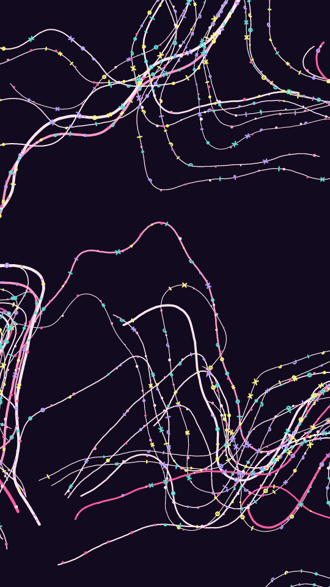

Bundles of fine strands on a dark ground. Each bundle starts from one spot and follows a curling flow field, so its strands run together like a rope and then fray apart. Most strands are fine and a few are heavy. Small arrows, rings, crosses, hooks and ticks ride along the strands in three accent colours, more of them near the far end. Some strands can also carry a chain of beads.

filament renders a Still: one frame. Its site page is [playgrnd.tools/filament](https://www.playgrnd.tools/filament/).

## Still



Seed 2, rendered by:

```sh
tirage derive --seed 2 --tool filament | tirage render --size 540x960 -o filament.png
```

## Parameters

As [`tirage tools`](/cli-reference/tools/) lists them, each with its range and step, or its choices:

```
filament  1 frame
  zoom        0.3..=6   step 0.05
  turn        0.2..=5   step 0.05
  oct         1..=6     step 1
  curl        0..=1     step 0.01
  tangle      0..=1     step 0.01
  bundles     1..=90    step 1
  per         1..=40    step 1
  clump       0..=1     step 0.01
  tight       0.005..=0.2 step 0.005
  len         20..=600  step 10
  step        1..=10    step 0.2
  wgt         0.2..=8   step 0.1
  wvar        0..=1     step 0.01
  hier        0..=1     step 0.01
  hair        0..=1     step 0.01
  mstyles     Symbols, Beads, Both
  mark        0..=1     step 0.01
  bead        0..=1     step 0.01
  bgap        2..=14    step 1
  msize       2..=26    step 0.5
  ditherTog   on/off
  dthKinds    Bayer 8, Bayer 4, Noise
  dthSize     1..=10    step 1
  dthLevels   2..=8     step 1
  dthAmount   0..=1     step 0.05
  grainTog    on/off
  grnBlends   Add, Overlay, Soft light, Multiply, Screen
  grnAmount   0..=1     step 0.05
  grnSize     0.5..=4   step 0.1
  grnSpecks   0..=1     step 0.05
  grnVignette 0..=1     step 0.05
```

A Seed draws all twenty of filament's own Parameters. `zoom`, `turn`, `oct` and `curl` shape the flow field, and `tangle` lets strands leave it and cross each other. `bundles` sets how many ropes there are, `per` how many strands each one has, `tight` how close they start, and `clump` how much the ropes gather in one part of the frame. `len` and `step` set how far a strand walks. `wgt`, `wvar` and `hier` set the stroke weights, and `hair` is the share of strands drawn as hairlines. `mstyles` picks symbols, beads or both. `mark` sets how many symbols there are, `bead` how many strands carry beads, `bgap` the spacing of the beads, and `msize` the size of every mark.

A Seed keeps `bundles` from 23 and `len` from 160. With a single bundle or a very short walk, the frame is almost empty. Every other Parameter can take its full range. The shared grain and dither stay off.

The Palette takes any number of inks from 2 and colours the strands and beads. The last ink draws the hairlines. The dark ground and the three symbol accents are fixed by filament itself.
