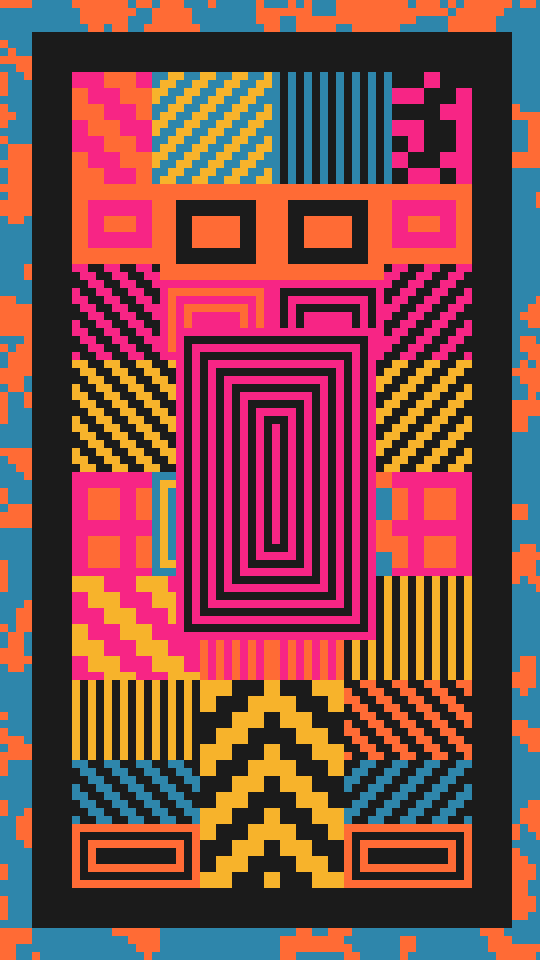

A screenprinted emblem. A mat of clotted marks frames a dark panel. Inside the panel, the left half is cut into rectangles, each printed with a flat two-ink pattern such as checks, stripes, bricks or nested rings. Every rectangle has a twin reflected across the centre line, and a small nested emblem sits in the middle. Every edge lands on one square grid, so nothing is blurred.

totem renders a Still: one frame. Its site page is [playgrnd.tools/totem](https://www.playgrnd.tools/totem/).

## Still



Seed 1, rendered by:

```sh
tirage derive --seed 1 --tool totem | tirage render --size 540x960 -o totem.png
```

## Parameters

As [`tirage tools`](/cli-reference/tools/) lists them, each with its range and step, or its choices:

```
totem  1 frame
  border      0..=0.4   step 0.005
  mat         0..=0.7   step 0.01
  matGrain    1..=6     step 1
  keyline     0..=10    step 1
  regions     1..=30    step 1
  grain       16..=220  step 1
  mirror      0..=1     step 0.01
  variety     0..=1     step 0.01
  core        0..=0.6   step 0.01
  coreRings   0..=8     step 1
  ditherTog   on/off
  dthKinds    Bayer 8, Bayer 4, Noise
  dthSize     1..=10    step 1
  dthLevels   2..=8     step 1
  dthAmount   0..=1     step 0.05
  grainTog    on/off
  grnBlends   Add, Overlay, Soft light, Multiply, Screen
  grnAmount   0..=1     step 0.05
  grnSize     0.5..=4   step 0.1
  grnSpecks   0..=1     step 0.05
  grnVignette 0..=1     step 0.05
```

A Seed draws all ten of totem's own Parameters. `border` sets the width of the mat, `mat` how much of it carries marks, and `matGrain` how big the marks are. `keyline` is the dark rule between the panel edge and the pattern, in grid cells. `regions` sets how many rectangles the half-panel is cut into. `grain` is the number of grid cells across the short edge, so it sets how coarse the whole print looks. It is totem's own grid, not the shared grain pass. `mirror` is the chance that a twin keeps its original's pattern instead of getting one of its own. `variety` sets how many patterns can appear, `core` the width of the central emblem, and `coreRings` how many rings it has.

A Seed keeps `grain` between 60 and 220, `regions` from 3, `border` up to 0.3 and `keyline` up to 6. A wide border and a wide keyline together leave only a thin strip of pattern. Every other Parameter can take its full range. The shared grain and dither stay off.

The Palette takes any number of inks from 2. The darkest ink prints the panel and the rules. Of the other inks, the first is the mat and the second to last prints the marks on it. With only one other ink, the marks are dark. Each rectangle picks a pattern ink from the other inks, and a ground from them or the dark ink, which comes up more often.
